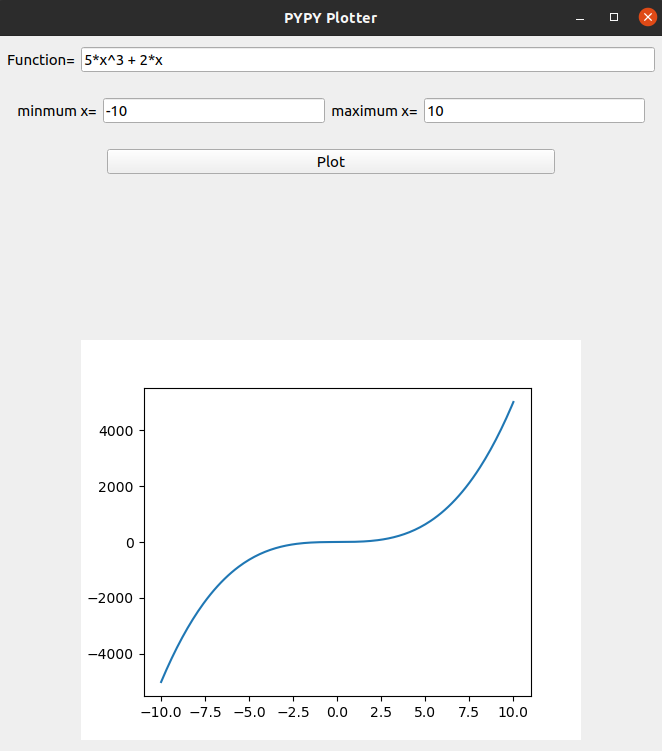
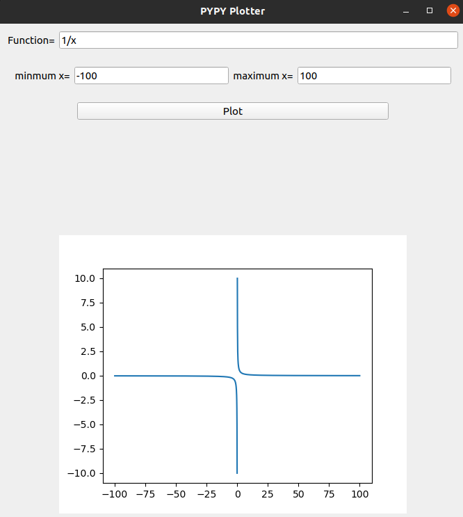
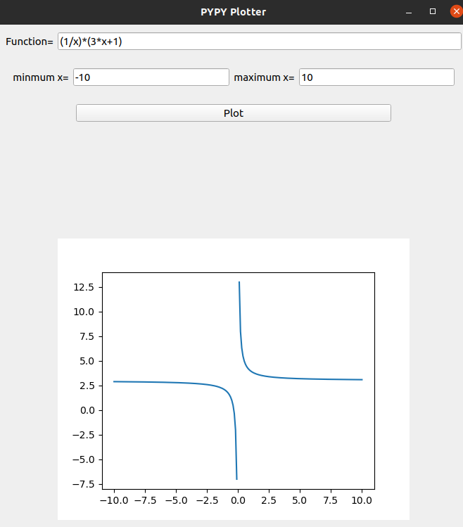
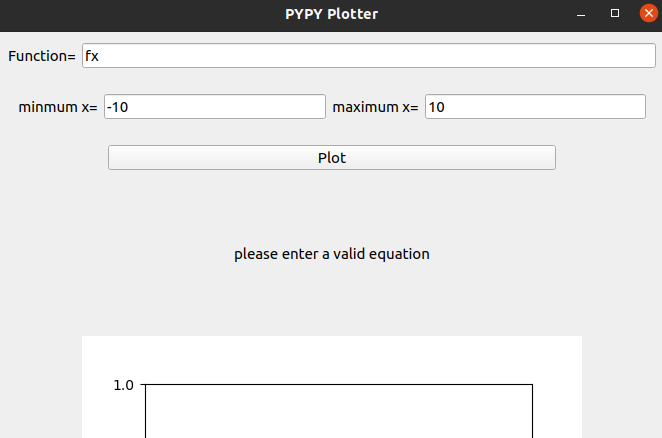
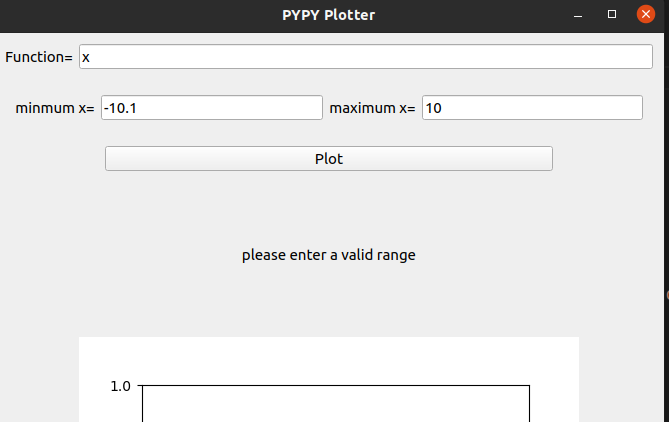
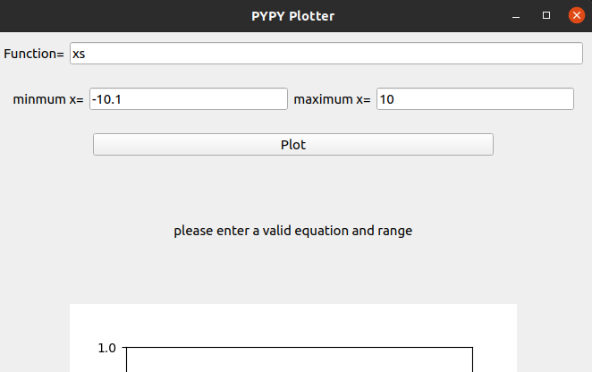

<h1 align="center">
  Function Plotter 
</h1>

<b> A function plotter done using Pyqt5 and matplotlib 
 </b>

   

# Input Constraints
1. The function should be in the form of a string, only allowed operations are +,-,*,/ and ^
2. minimum x and maximum x should be given in form of Integer only

## Working Examples

   

   

## Error messages when invalid input

   

   

   

